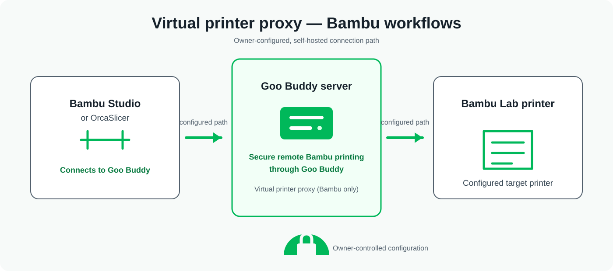

<p align="center">
  
</p>

<h1 align="center">Goo Buddy</h1>

<p align="center">
  <strong>Self-hosted, local-first 3D-printer management.</strong><br>
  Built to run well on Raspberry Pi and other Docker-capable hosts.
</p>

Goo Buddy is evolving the Bambu-focused foundation inherited from Bambuddy
into a capability-driven, multi-platform printer manager. It keeps printer
support honest: a platform is only offered with the capabilities that Goo
Buddy can validate and safely provide.

## Platform support

| Platform | Current support | Setup and safety boundary |
| --- | --- | --- |
| Bambu Lab | Mature inherited functionality, covered by ongoing Bambu regression tests | Existing Bambu setup and capabilities remain available. |
| Elegoo Centauri / OpenCentauri (SDCP v3) | Validated read-only monitoring | Manual, opt-in private-network source. No discovery or automatic contact. |
| Klipper through Moonraker | Alpha read-only monitoring | Manual, opt-in private-network source. No discovery or automatic contact. |

The Elegoo and Moonraker sources are monitoring-only. They do not provide
uploads, G-code, console access, files, camera, maintenance, printer controls,
or CANVAS where no authoritative mapping exists. Unsupported capabilities are
shown as unavailable rather than represented as working controls.

OrcaSlicer continues to use ElegooLink directly for Elegoo print submission.
Goo Buddy does not submit Elegoo jobs, and the Moonraker alpha does not upload,
start, or control prints.

## Get started

### Docker Compose

Goo Buddy `0.3.0-alpha.4` is distributed as a public, multi-architecture OCI
image for `linux/amd64` and `linux/arm64`. The normal published-image install
does not compile source on the host:

```bash
git clone https://github.com/James-Jennison/Goo-Buddy.git
cd Goo-Buddy
cp .env.release.example .env
docker compose -f docker-compose.release.yml pull
docker compose -f docker-compose.release.yml up -d
```

The published Compose contract binds to `127.0.0.1:8000` by default. Check the
service before deciding whether to place it behind a separately configured
reverse proxy:

```bash
docker compose -f docker-compose.release.yml logs -f goo-buddy
curl -f http://127.0.0.1:8000/health
```

See the [Raspberry Pi and Docker installation guide](docs/RASPBERRY_PI_FIRST_RUN.md)
for ARM64 requirements, immutable digest pinning, backup, restore, rollback,
and a compatibility-preserving upgrade from a Bambuddy-derived Compose layout.
The legacy `docker-compose.yml` remains available only for source-build and
upgrade compatibility; do not rename its `bambuddy_data` or `bambuddy_logs`
volumes during an upgrade.

Stop the published-image stack with:

```bash
docker compose -f docker-compose.release.yml down
```


## Manual printer setup

Add printers from the Goo Buddy setup or printer page. New non-Bambu sources
start disabled and make no connection until their owner explicitly enables
them.

### Elegoo SDCP v3

Enter a canonical RFC1918 IPv4 address. Goo Buddy derives the fixed SDCP v3
WebSocket endpoint itself and does not accept a hostname or arbitrary URL. Its
outbound SDCP surface is closed to the documented text `ping`, Cmd `0` status
refresh, and Cmd `1` attributes refresh. It never sends print, motion,
temperature, file, or other mutating commands.

See the [Elegoo SDCP v3 read-only connection guide](docs/ELEGOO_SDCP_V3_READ_ONLY.md)
for its lifecycle, privacy boundary, and known limits.

### Klipper through Moonraker

Choose HTTP or HTTPS, enter a canonical RFC1918 IPv4 address and explicit
port (default `7125`), and optionally save an API key through Goo Buddy's
protected-secret mechanism. Goo Buddy derives the permitted endpoints itself;
it does not accept arbitrary URLs, hostnames, paths, redirects, or proxy
expansion.

The alpha uses only fixed HTTP reads and a closed status-query/subscription
surface. It has no generic JSON-RPC, G-code, file, upload, restart, machine,
or control path. See the [Moonraker read-only alpha guide](docs/MOONRAKER_READ_ONLY_ALPHA.md)
for the exact allowlist and compatibility details.

## Bambu virtual printer proxy

The existing virtual-printer proxy is a Bambu-specific feature for compatible
Bambu Studio and OrcaSlicer workflows. When configured by its owner, the
slicer connects to Goo Buddy, which relays compatible virtual-printer services
to the selected Bambu Lab printer. Its proxy implementation uses
protocol-specific TLS handling; configure it through the Goo Buddy UI and keep
the generated certificate material private.

<p align="center">
  
</p>

This feature is separate from the read-only Elegoo and Moonraker integrations.
It does not grant those platforms Bambu virtual-printer, print, upload, or
control capabilities.

## What Goo Buddy does not do

- It does not host a public demo service.
- Normal installations do not include or show the development-only synthetic
  printer-state matrix used for local UI review.
- Elegoo and Moonraker sources do not scan a LAN, use broadcast discovery, or
  contact a printer automatically.
- The new read-only sources never expose endpoints, credentials, raw protocol
  payloads, or sensitive printer identifiers in ordinary dashboard views.

## Documentation

- [Architecture and capability-driver boundary](docs/GOO_BUDDY_ARCHITECTURE.md)
- [Elegoo SDCP v3 read-only connection](docs/ELEGOO_SDCP_V3_READ_ONLY.md)
- [Moonraker / Klipper read-only alpha](docs/MOONRAKER_READ_ONLY_ALPHA.md)
- [Raspberry Pi first run](docs/RASPBERRY_PI_FIRST_RUN.md)
- [Container distribution and verification](docs/CONTAINER_BUILDS.md)
- [Project roadmap](docs/GOO_BUDDY_ROADMAP.md)
- [Contributing](CONTRIBUTING.md)
- [Security policy](SECURITY.md)

## Contributing

Please read [CONTRIBUTING.md](CONTRIBUTING.md), keep capability claims
evidence-backed, and preserve the safety boundaries around printer transports,
secrets, and persisted configuration.

## License

Goo Buddy is distributed under the [GNU Affero General Public License v3.0](LICENSE).

## Upstream foundation and attribution

Goo Buddy began as a fork of [Bambuddy](https://github.com/maziggy/bambuddy).
Bambuddy provided the original Bambu-focused application foundation. Goo Buddy
retains applicable upstream copyright, AGPL-3.0 licensing obligations, and Git
history; its Elegoo, Moonraker, capability-driver, branding, and related work
is developed separately. The configured upstream remote is preserved, and
[upstream synchronization](docs/UPSTREAM_SYNC.md) is reviewed as a separate
activity.
